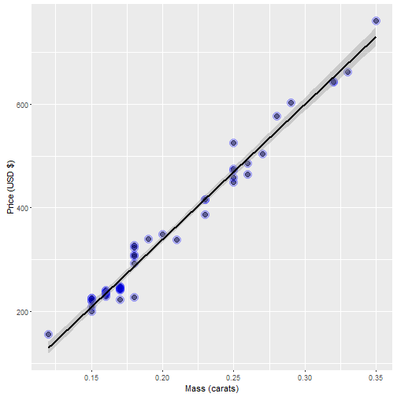

Course Project: Shiny Application and Reproducible Pitch
========================================================
author: Ramiro Asturias
date: November 21, 2016
autosize: true

Project Description and Objectives
========================================================

        This is the Deck for the Course Project of the “Developing Data products” course.
        The project consists in two activities:
        - Create a Shiny application 
                <https://rasturias.shinyapps.io/ShinyApplication/>
        - Create a presentation in Slidify or Rstudio Presenter to pitch for the application.
        - Complete project source code at GitHub 
                <https://github.com/rasturias/shinyApp>
        
        The Objective is to generate a Shiny APP and use R on to generate the outputs.
        


Shiny Application Developed
========================================================

Based on diamond data set from the UsingR package. 
The data is diamond prices USD dollars and diamond weight in carats. 
Carats are a standard measure of diamond mass, 0.2 grams. 
We will predict the price for the diamond based on the Carat Mass

Information about the dataset:


```r
library(UsingR)
summary(diamond)
```

```
     carat            price       
 Min.   :0.1200   Min.   : 223.0  
 1st Qu.:0.1600   1st Qu.: 337.5  
 Median :0.1800   Median : 428.5  
 Mean   :0.2042   Mean   : 500.1  
 3rd Qu.:0.2500   3rd Qu.: 657.0  
 Max.   :0.3500   Max.   :1086.0  
```

Diamond Model Created
========================================================

- I used lm to fit a linear model based on diamond dataset.
- With this linear model, we can predict a diamond's price based on the carats.
- This is a graphic representation of the dataset.



Diamond Price Calculator Shiny Application
========================================================

- The application can be found in https://rasturias.shinyapps.io/ShinyApplication

